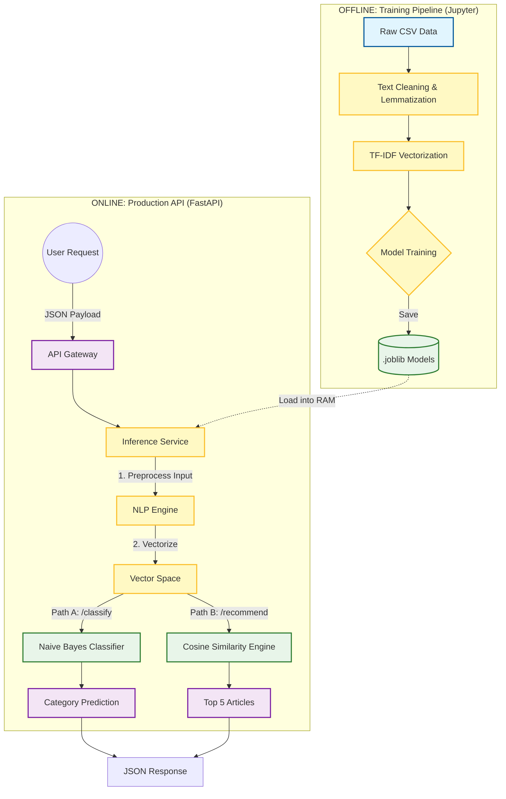

# 📰 NewsAI: Intelligent News Classification & Recommendation Engine


## 📖 Executive Summary

This project implements a scalable **Natural Language Processing (NLP)** pipeline designed to automate editorial workflows and enhance user engagement on news platforms.

The solution addresses two core challenges:
1.  **Automated Tagging:** Automatically classifying raw news articles into 17 distinct topics (e.g., Sport, Politics, Economy).
2.  **Content Discovery:** A recommendation engine that retrieves semantically similar articles based on user interests.

Instead of a static script, the final solution is industrialized as a **REST API Microservice** using **FastAPI**, following a clean "Service-Layer" architecture pattern.

---

## 🏗️ System Architecture

The system is designed to handle the full lifecycle of the ML model, from raw data processing to live inference.



## 🧠 Technical Implementation

### 1. The Classification Engine (Topic Detection)
* **Algorithm:** Multinomial Naive Bayes.
* **Why:** Chosen for its efficiency and strong performance on high-dimensional text data compared to heavier Deep Learning models.
* **Performance:** Achieved **~71% Accuracy** on a balanced test set.
* **Strengths:** High precision on distinct topics like *Sport (90%)* and *Weather (92%)*.
* **Challenges:** Semantic overlap between *Society*, *Human Interest*, and *Arts*.

### 2. The Recommendation Engine (Search)
* **Algorithm:** Content-Based Filtering using Cosine Similarity.
* **Logic:**
    1.  User query is converted into a mathematical vector using **TF-IDF**.
    2.  The system calculates the geometric angle between the query vector and **10,000+ article vectors**.
    3.  Returns the "nearest neighbors" (articles pointing in the same semantic direction).

---

## 🎯 Addressing the Challenge: "Articles Hating XYZ"

The project goal included a specific user scenario: *"I like political articles hating XYZ, what else should I read?"*

### Current Capability (The "XYZ" Part)
The current TF-IDF + Cosine Similarity pipeline is excellent at **Information Retrieval**. It successfully identifies the Topic.

> **Input:** "I hate taxes."
> **Result:** Articles discussing taxes, finance, and government policy.
> **Verdict:** ⚠️ *Partial Success. The system finds the subject, but ignores the attitude.*

### Limitations & Proposed Solution (The "Hating" Part)
* **Limitation:** TF-IDF is "sentiment-blind." It treats the word "hate" as just another keyword, not as an emotional indicator.

**Future Architecture for Full Solution:**
To filter by stance ("hating"), I propose adding a Secondary Filtering Layer:

1.  **Stage 1 (Retrieval):** Use current TF-IDF to get all articles about "XYZ".
2.  **Stage 2 (Sentiment Analysis):** Pass the retrieved articles through a Sentiment Model (e.g., **VADER** or **BERT**).
3.  **Stage 3 (Filtering):** Keep only articles where `sentiment_score < -0.5` (Negative/Hateful).

---

## 🛠️ How to Run

### Prerequisites
* Python 3.8+
* Pip

### 1. Installation

```bash
# Clone the repository
git clone <repository-url>

# Install dependencies
pip install fastapi uvicorn scikit-learn pandas nltk joblib
```

### 2. Start the Microservice
Launch the server from the project root:

```bash
uvicorn app:app --reload
```

### 3. Usage (Swagger UI)
Open your browser at [http://127.0.0.1:8000/docs](http://127.0.0.1:8000/docs). You will see the interactive documentation.

**POST `/classify`**
```json
{
  "title": "NASA Lands on Mars",
  "content": "The rover touched down successfully..."
}
```
**POST `/recommend`**
```json
{
  "text": "I want to read about football championships",
  "top_n": 5
}
```

## 📂 Project Structure

A modular "separation of concerns" structure was used to ensure maintainability:
```text
├── data/                   # Processed datasets (CSV)
├── models/                 # Serialized ML models (.joblib)
├── notebooks/              # Experimental code (EDA, Training, Evaluation)
├── src/                    # Internal Modules
│   ├── inference.py        # Business Logic & ML Service Layer
│   └── schemas.py          # Pydantic Data Contracts (Validation)
└── app.py                  # API Controller (Routes) - Entry Point
```
